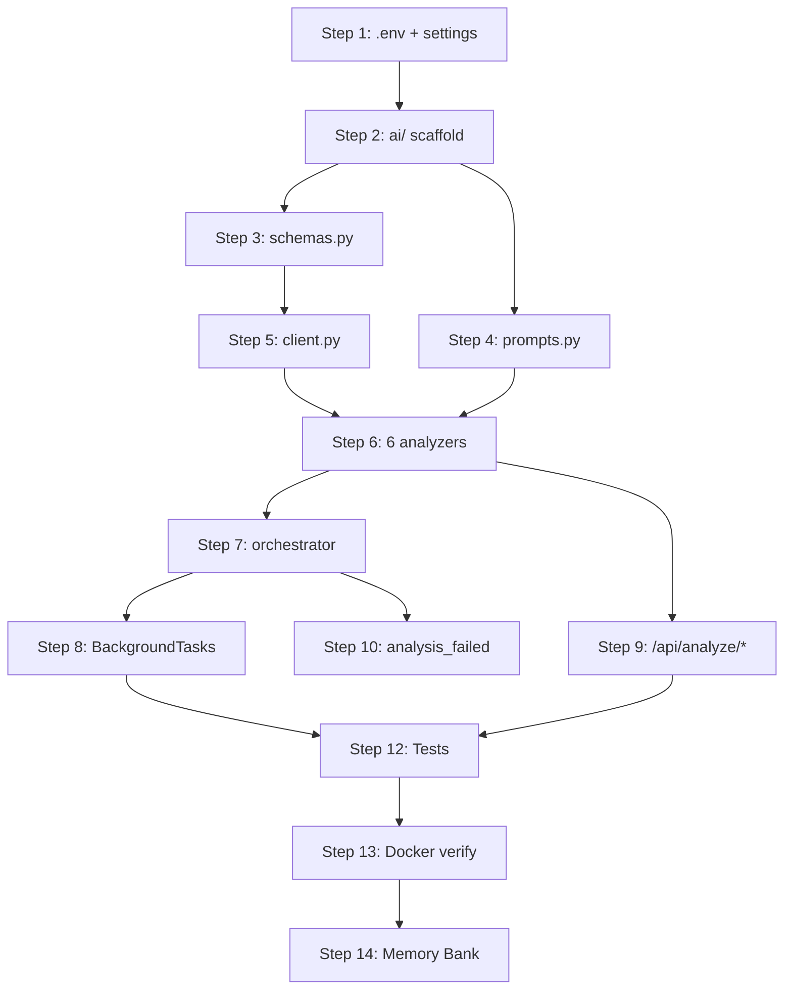

# Phase 3: AI Analysis Pipeline — Implementation Plan

> **Status:** Ready to implement  
> **Depends on:** Phase 2 (complete ✅)  
> **Blockers:** `GEMINI_API_KEY` must be set in `.env`  
> **Estimated commits:** 12–15 atomic commits

---

## Overview

Phase 3 builds the `app/services/ai/` module — a 6-modality AI analysis pipeline powered by `gemini-3-flash-preview`. Every incident submitted to Satark gets analyzed asynchronously via `BackgroundTasks`, with the frontend polling until analysis completes.

### File Tree (what we're building)

```
app/services/ai/
├── __init__.py
├── client.py          # Gemini client singleton + retry wrapper
├── schemas.py         # ThreatAnalysis Pydantic model (MOVE from app/schemas/analysis.py)
├── prompts.py         # System prompt + 6 prompt templates
├── orchestrator.py    # Routes incident → correct analyzer, updates DB
├── analyzers/
│   ├── __init__.py
│   ├── text.py        # Text message analysis
│   ├── url.py         # URL structure + metadata analysis
│   ├── image.py       # Image analysis (inline bytes)
│   ├── audio.py       # Audio analysis (Files API upload)
│   ├── video.py       # Video analysis (Files API upload)
│   └── document.py    # PDF/DOCX analysis (inline bytes or Files API)

app/routers/
├── analyze.py         # NEW — /api/analyze/text, /api/analyze/url, /api/analyze/file
```

---

## Step-by-Step Implementation

### Step 1: `.env` + Settings Update

**File:** `.env`, `app/core/settings.py`  
**Commit:** `chore: add GEMINI_API_KEY placeholder and AI concurrency setting`

Add to `settings.py`:
```python
AI_CONCURRENCY_LIMIT: int = 5  # Max parallel AI calls (free tier guard)
```

Add actual key to `.env`. The `GEMINI_API_KEY` setting already exists with default `""`.

---

### Step 2: Scaffold AI Service Package

**Commit:** `feat: scaffold AI service package`

Create:
- `app/services/ai/__init__.py`
- `app/services/ai/analyzers/__init__.py`

---

### Step 3: Move ThreatAnalysis to AI Package

**Commit:** `refactor: move ThreatAnalysis to AI service package`

Move `ThreatAnalysis` from `app/schemas/analysis.py` → `app/services/ai/schemas.py`. Keep a re-export in the original location so nothing breaks:

```python
# app/schemas/analysis.py — updated
from app.services.ai.schemas import ThreatAnalysis  # re-export
```

---

### Step 4: Prompt Templates

**Commit:** `feat: add all 6 AI prompt templates`

**File:** `app/services/ai/prompts.py`

Contains `SYSTEM_PROMPT_BASE` + 6 templates from `docs/ai-integration.md`:

| Constant | Purpose |
|----------|---------|
| `SYSTEM_PROMPT_BASE` | CERT-Army analyst role, Indian context |
| `TEXT_ANALYSIS_PROMPT` | Suspicious text/SMS |
| `URL_ANALYSIS_PROMPT` | URL structure, TLD, typosquatting |
| `IMAGE_ANALYSIS_PROMPT` | OCR + visual phishing |
| `AUDIO_ANALYSIS_PROMPT` | Transcription + vishing |
| `VIDEO_ANALYSIS_PROMPT` | Screen recording / deepfake |
| `DOCUMENT_ANALYSIS_PROMPT` | Fake gov notices, embedded links |

---

### Step 5: Gemini Client Singleton

**Commit:** `feat: add AI client singleton with retry and concurrency control`

**File:** `app/services/ai/client.py`

Key features:
- **Singleton** — one `genai.Client`, created lazily
- **Exponential backoff** — retries on `429 RESOURCE_EXHAUSTED` (3 attempts: 2s, 4s, 8s)
- **Semaphore** — `asyncio.Semaphore(5)` prevents quota exhaustion
- **Structured output** — `response_mime_type="application/json"` + `response_schema=ThreatAnalysis`
- **Files API helper** — `upload_file_to_gemini()` for audio/video, polls until `state == ACTIVE`

```python
async def generate_structured(contents, response_schema, max_retries=3) -> str:
    """Call Gemini with structured output. Returns raw JSON string."""

async def upload_file_to_gemini(file_path, mime_type):
    """Upload via Files API. Polls until ACTIVE."""
```

> [!NOTE]  
> `google-genai` SDK's `generate_content` is synchronous. Acceptable for demo — production would use `run_in_executor`.

---

### Step 6: Six Analyzer Modules

Each follows the same interface:
```python
async def analyze(content_or_path: str, mime_type: str | None = None) -> ThreatAnalysis
```

#### 6a: `analyzers/text.py` — **Commit:** `feat: add text analyzer`
- Input: raw text string
- Builds prompt from `TEXT_ANALYSIS_PROMPT` template
- Calls `generate_structured()` → `ThreatAnalysis.model_validate_json()`

#### 6b: `analyzers/url.py` — **Commit:** `feat: add URL analyzer`
- Input: URL string
- Parses with `urllib.parse`: domain, TLD, path, HTTPS, length, is_shortened, has_IP, unusual_chars
- Formats `URL_ANALYSIS_PROMPT` with extracted signals

#### 6c: `analyzers/image.py` — **Commit:** `feat: add image analyzer`
- Input: file path + mime_type
- Reads file → `types.Part.from_bytes(data=bytes, mime_type=...)`
- Contents: `[prompt_text, image_part]`

#### 6d: `analyzers/audio.py` — **Commit:** `feat: add audio analyzer`
- Input: file path + mime_type
- Files > 20MB: Files API upload; smaller: inline bytes
- Contents: `[prompt_text, audio_part]`

#### 6e: `analyzers/video.py` — **Commit:** `feat: add video analyzer`
- Input: file path + mime_type
- **Always** uses Files API (videos need server-side processing)
- Polls until `state == ACTIVE`

#### 6f: `analyzers/document.py` — **Commit:** `feat: add document analyzer`
- Input: file path + mime_type
- PDF ≤ 50MB: `Part.from_bytes()`; DOCX: Files API upload

---

### Step 7: Orchestrator

**Commit:** `feat: add AI orchestrator for background task analysis`

**File:** `app/services/ai/orchestrator.py`

Flow:
1. Creates **own DB session** (`SessionLocal()`) — NOT the request-scoped one
2. Sets `incident.status = "analyzing"`
3. Routes to correct analyzer based on `input_type`
4. For file-based types: resolves local file path from `evidence_files[0].storage_path`
5. On success: writes `classification`, `threat_score`, `confidence`, `ai_analysis` (full dict), `priority` (via `score_to_priority()`), sets `status = "analyzed"`
6. On failure: sets `status = "analysis_failed"`, logs error
7. Creates audit log: `"ai_analysis_complete"` or `"ai_analysis_failed"` with `actor_label="AI_AGENT"`
8. Always `db.close()` in `finally` block

> [!IMPORTANT]
> **DB Session in background tasks:** `Depends(get_db)` is closed after response. The orchestrator MUST create its own `SessionLocal()`.

```python
async def analyze_incident(incident_id: str) -> None:
    from app.core.database import SessionLocal
    db = SessionLocal()
    try:
        # ... analysis logic ...
    finally:
        db.close()
```

---

### Step 8: Wire BackgroundTasks into Incident Creation

**Commit:** `feat: trigger AI analysis on incident creation`

**File:** `app/routers/incidents.py`

```python
from fastapi import BackgroundTasks
from app.services.ai.orchestrator import analyze_incident

@router.post("", status_code=201)
async def create_incident(
    background_tasks: BackgroundTasks,  # ADD
    # ... rest unchanged
):
    incident = await incident_service.create_incident(...)
    background_tasks.add_task(analyze_incident, str(incident.id))
    return {"data": ..., "message": "Incident submitted. AI analysis in progress."}
```

---

### Step 9: Quick-Scan Router

**Commit:** `feat: add quick-scan endpoints (text, URL, file)`

**File:** `app/routers/analyze.py`

| Endpoint | Input | Auth | Notes |
|----------|-------|------|-------|
| `POST /api/analyze/text` | `{"content": "..."}` | None | Synchronous, no DB |
| `POST /api/analyze/url` | `{"content": "https://..."}` | None | Synchronous, no DB |
| `POST /api/analyze/file` | Multipart upload | None | Save to temp, analyze, cleanup |

Wire into `app/main.py`:
```python
from .routers import analyze
app.include_router(analyze.router, prefix="/api")
```

---

### Step 10: `analysis_failed` Status

**Commit:** `feat: add analysis_failed to incident status constants`

**File:** `app/core/constants.py`

Add `ANALYSIS_FAILED = "analysis_failed"` to `IncidentStatus` class and `ALL` list.

---

### Step 11: URL Parsing Utility

**Commit (bundled with Step 6b)**

Internal helper in `analyzers/url.py` using `urllib.parse` — extracts domain, TLD, is_shortened (bit.ly, t.co, etc.), has_IP, has_unusual_chars.

---

### Step 12: Tests (10 Cases, All Mocked)

**Commit:** `test: add AI pipeline unit tests with mocked responses`

**File:** `tests/test_ai_pipeline.py`

| # | Test | Strategy |
|---|------|----------|
| 1 | `test_text_analyzer_phishing` | Mock → classification=phishing |
| 2 | `test_text_analyzer_safe` | Mock → classification=safe |
| 3 | `test_url_analyzer_suspicious_tld` | Mock → .tk domain flagged |
| 4 | `test_url_parse_signals` | Unit test URL parser (no mock) |
| 5 | `test_orchestrator_updates_incident` | Mock analyzer + verify DB fields |
| 6 | `test_orchestrator_handles_failure` | Mock raises → status=analysis_failed |
| 7 | `test_score_to_priority_mapping` | Verify all ranges (no mock) |
| 8 | `test_quick_scan_text_endpoint` | TestClient + mock |
| 9 | `test_quick_scan_url_endpoint` | TestClient + mock |
| 10 | `test_incident_triggers_background` | Verify task queued |

Mock pattern:
```python
@patch("app.services.ai.client.get_ai_client")
async def test_text_analyzer(mock_client):
    mock_response = MagicMock()
    mock_response.text = MOCK_PHISHING_JSON
    mock_client.return_value.models.generate_content.return_value = mock_response
    result = await text_analyzer.analyze("Click here to verify...")
    assert result.classification == "phishing"
```

---

### Step 13: Docker Verification

```bash
make up && make logs-be   # No import errors
make test-be              # All tests pass (mocked, no API key needed)
```

---

### Step 14: Memory Bank Update

**Commit:** `docs: update Memory Bank — Phase 3 complete`

---

## Dependency Graph



---

## Key Design Decisions

| Decision | Choice | Rationale |
|----------|--------|-----------|
| DB session in background task | New `SessionLocal()` | Request-scoped session is closed when BackgroundTask runs |
| File upload method | Inline (<20MB) vs Files API (>20MB) | Per Google docs: inline limit 100MB, but Files API needed for video processing state |
| Video always uses Files API | Yes | Videos need server-side processing |
| Concurrency limit | `asyncio.Semaphore(5)` | Free tier rate limits |
| Structured output | `response_schema=ThreatAnalysis` | SDK accepts Pydantic models directly |
| Quick scan = no DB write | Yes | `/api/analyze/*` returns results directly |
| Prompts as constants | `prompts.py` only | Per Rule 06: never inline strings |

## Risk Mitigations

| Risk | Mitigation |
|------|------------|
| API key not set | Startup warning; endpoints return 503 |
| Malformed AI JSON | `model_validate_json()` → `ValidationError` → `analysis_failed` |
| Rate limiting (429) | Exponential backoff × 3 retries |
| Large video timeout | Files API polling, 5-min hard timeout |
| DB session leak in background | `try/finally` with `db.close()` |
| `google-genai` dependency | ✅ Already in `packages/requirements.txt` |

---

## Checklist

- [ ] Step 1: `.env` + settings
- [ ] Step 2: `ai/` package scaffold
- [ ] Step 3: Move `ThreatAnalysis` to `ai/schemas.py`
- [ ] Step 4: `prompts.py` — 6 templates
- [ ] Step 5: `client.py` — singleton + retry + semaphore
- [ ] Step 6a: `analyzers/text.py`
- [ ] Step 6b: `analyzers/url.py`
- [ ] Step 6c: `analyzers/image.py`
- [ ] Step 6d: `analyzers/audio.py`
- [ ] Step 6e: `analyzers/video.py`
- [ ] Step 6f: `analyzers/document.py`
- [ ] Step 7: `orchestrator.py`
- [ ] Step 8: Wire `BackgroundTasks` into incident creation
- [ ] Step 9: `/api/analyze/*` quick-scan router
- [ ] Step 10: `analysis_failed` status constant
- [ ] Step 11: URL parsing utility
- [ ] Step 12: Tests (10 cases, all mocked)
- [ ] Step 13: Docker verification
- [ ] Step 14: Memory Bank update
